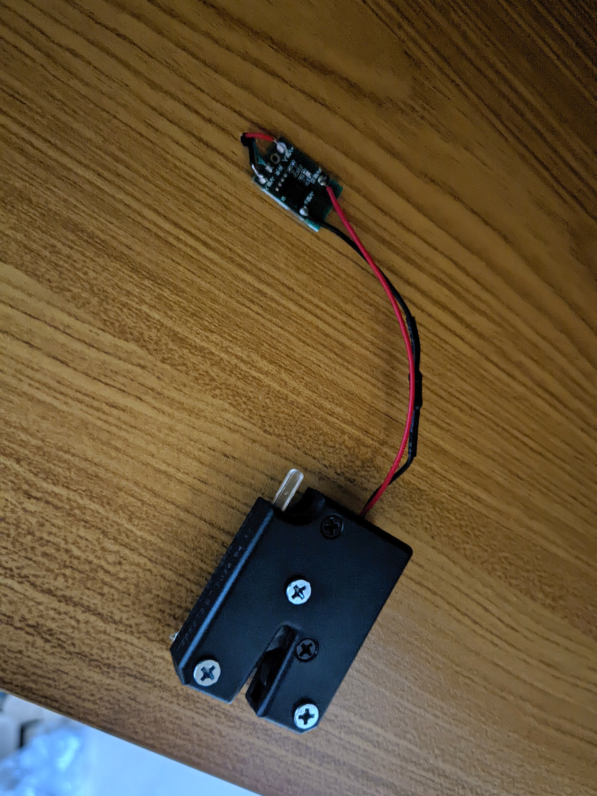
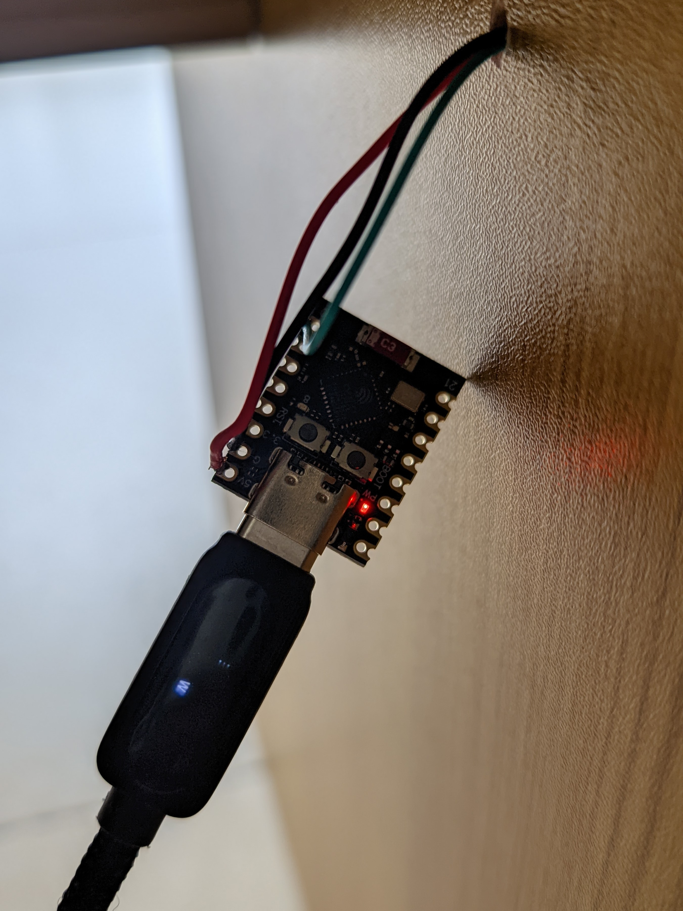
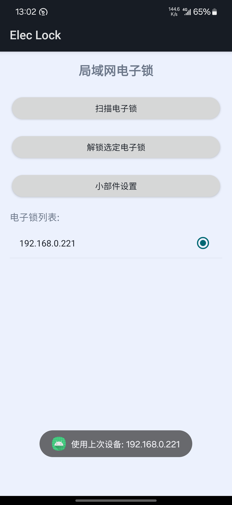

# 网络电子锁控制系统

这是一个完整的电子锁控制系统，包含Linux桌面应用、Android应用以及ESP32微控制器等。该系统允许通过多种方式远程控制电子锁的开关。此项目不使用英文介绍，因为此项目仅针对中国青少年使用：如果您的父母尊重您的隐私，您无需此项目。如果您的父母不尊重您的隐私，我相信以他们的能力看不懂此项目，您可以放心安全性问题。




### 1. Linux桌面应用 (Elec_Lock.c)

一个基于GTK的状态栏小应用程序控制电子锁。

#### 软件功能：

- 系统托盘图标显示
- 左键单击解锁
- 右键单击选择串口设备
- 支持自动检测串口设备 (ttyUSB, ttyACM, ttyS)
- 通过串口与ESP32通信发送控制命令

#### 构建依赖：

```bash
make install-deps  # 安装GTK+开发库
```

#### 编译运行：

```bash
make                 # 编译程序
./Elec-Lock         # 运行程序
```

### 2. Android应用 (Android_APP)

一个完整的Android应用，包含设备扫描、解锁控制和桌面小部件功能。


#### 软件功能：

- 局域网设备自动扫描
- 设备列表管理
- 单独设备解锁控制
- 桌面小部件快速解锁
- 状态通知反馈
- 记住最后使用的设备

#### 权限要求：

- INTERNET - 网络访问
- ACCESS_NETWORK_STATE - 网络状态
- VIBRATE - 震动通知
- POST_NOTIFICATIONS - 发送通知

## 硬件需求：

- ESP32开发板（推荐ESP32-C3）
- 电磁锁或其他电子锁设备
- 适当的电源供应
- PWM控制MOS模块

## 网络配置：

ESP32连接WiFi网络请自行修改以下文件：

- `PWM-Lock/PWM-Lock.ino` 中的WiFi配置

## 硬件连接：

ESP32的A4引脚连接到PWM控制MOS模块的IO引脚，供电请自行连接。

## 安全问题：

- HTTP通信无加密，明文通讯
- 电子锁控制权限与网络访问权限相同
